### Building Our Own DevOps Tools.  Updating Databases Edition.

##### Concept
DevOps calls for creative thinking about how to use the tools in front of us to solve problems.  Too many teams don't have the tools that they need, and/or are forced to use (sometimes) expensive tools to do their jobs.

For this project, I am forking code from the https://github.com/hdeiner/zipster-Vault-AWS-build-environments-on-demand project.  That project provisioned environments to allow testing (and production) to allow an easy to understand web service, and database system, including global secrets management.  We need only concern ourselves with the database management aspects of that solution.  In the project I've forked from, I used a real database migration tool called FlyWay to handle the migration from one version to the next.  But our situation today is that we don't use such a tool and store our migration scripts in a repository, and manage which scripts to run when ourselves.  We still need a programatic way to remote into a server to run the scripts from and then execite the scripts against the database that needs updating. 

This project will create and use a tool called remote_database_updater.py and demonstrate it's use in the following environments:
<ul>
<li>Local MySQL [Linux]</li>
<li>Local Oracle [Linux]</li>
<li>Local SQL Server [Linux]</li>
<li>AWS EC2 MySQL [Linux]</li>
<li>AWS EC2 Oracle [Linux]</li>
<li>AWS EC2 SQL Server [Windows Server]</li>
</ul>

#### Installation
Make sure that Python is installed and usable from the command line.

This project was developed under Python 3.6.9.  You can check with
```bash
python --version
```

Once the project files have been put in place (git clone is your friend here), install all the PyPi dependencies by
```bash
python -m pip install -r requirements.txt
```

##### Usage - Docker Image Creation
Since the code being used is based on Docker Images, we must first build those images

Vault
<BR />
\
\
<BR />
MySQL
<BR />
\
\
<BR />
Spark
\
\
<BR/>
---
##### Usage - Local MySQL [Linux]
Here, the pattern of how the testing occurs is introduced.  The is a "bring_up" script, a "test" script, and a "bring down" script.  Our primary attention is the "bring_up" script, as that's where remote_database_updater.py is used.

Bring Up
<BR/>
\
<BR/>
We can just monitor the Vault stuff here to see that nothing is blatantly wrong.  The last few lines here are probably where we should start paying attention, as this is where the MySQL database is being brought to life.
<BR/><BR/>
\
<BR/>
Things are getting more interesting.  We'll probably do something similar in the future.  We are setting up an environment for "howarddeiner" in Vault, and identifying where the database connection for that is located well as setting it's status to "created".

Under the banner of "Waiting for MySQL to start", we are asking a simple request from MySQL ('select count(*) from sys.sys_config;') and looking for a reasonable response.  If we don't get a reasonable response, we sleep for 5 seconds and try again.  We see about 20 seconds of time taken while MySQL spins up, as evidenced by 'ERROR 2013 (HY000): Lost connection to MySQL server at 'reading initial communication packet', system error: 2' errors showing up on the console.

Once we finally are sure that MySQL is ready, we update the database status in Vault to "running".
<BR/><BR/>
\
<BR/>
Now we're seeing remote_database_updater.py do it's magic.

There are 4 SQL scripts being executed that seperate the database updates into SQL scripts for the schema, static data, spacial data, and test data.  Each of these is introduced to the database in turn, all controlled by the part of the script that reads
```bash
figlet -w 160 -f small "Create Database"
cd ../../../..
python remote_database_updater.py -f localhost.csv
cd -
```
And if we look at the file used by remote_database_updater.py, we see
```console
sql_runner_host,sql_runner_userid,sql_runner_password,database_host,database_userid,database_password,port,database,sql_script_to_run
localhost,howarddeiner,password,127.0.0.1,root,password,3306,zipster,environment_creators/src/sql/V1_1__Zipcode_Schema.sql
localhost,howarddeiner,password,127.0.0.1,root,password,3306,zipster,environment_creators/src/sql/V1_2__Zipcode_Static_Data.sql
localhost,howarddeiner,password,127.0.0.1,root,password,3306,zipster,environment_creators/src/sql/V2_1__Add_Spatial_Data.sql
localhost,howarddeiner,password,127.0.0.1,root,password,3306,zipster,environment_creators/src/sql/V3_1__Zipcode_Test_Data.sql
```
This is where we specify what machine will be ssh'ed into and how, what machine has the MySQL database, and how to connect to it, and where the file that holds the SQL commands is located.

ssh_and_run_database_script is responsible for ssh'ing into the machine that will execute the database script updates.  First, it copies the SQL script via SFTP to the ssh machine, and the exedcutes the mysql command on that machine to update the database.

You may well be asking yourself, "Wait a minute.  We are executing on the same machine that the database is running on.  Why ssh into ourselves to run the commands?"  The answer is that we want to gain confidence that as we move up from environment to environment (local, CI, QA, UAT, PREPROD, and PROD), we are testing that we can establish our environment consistently.  This helps make for better products.

When you examine the code in ssh_and_run_database_script.py, you'll notice that the exitstatus is set to fail is any exception is raised or if stderr returns anything other than a [Warning].  That is so the script can be trusted to go no further once a real error occurs.

OK.  Back to the show.
<BR/><BR/>
\
<BR/>
The same basic philosophy is used when starting up the Spark Web Service.  The container is started.  We update Vault to show where it exists in our environment and that it is in the "started" state.  We run a small smoke test against the server, and if it fails (as when the server is starting), we sleep for 5 seconds and try again.  We display the results of that smoke test to the console, and then update Vault to say that the server is "running".

The screen shots for 02_test.sh and 03_bring_down.sh are not shown for briveity.  But do use them!

Complete.  Repeatable.  Informative.  Schedulable.  Portable.

And fairly easy!
<BR/>
---
##### Usage - AWS EC2 MySQL [Linux]
Since this project needs environments to test from, I chose to use AWS EC2 istances to create a repeatable environment to demonstrate how the code gets used in real life.  As you recall, there are three components for the environments: a global Vault server, an environment database (MySQL here) server, and an application server (the zipster code, written in Java and using Spark, for a REST service).

Let's go through the commands that demonstrate the code.  I will try to keep the unnecessary complexities of Terraform and AWS to a minimum.
<BR/><BR/>
The first thing that has to be done is to have that global Vault environment established.  It starts with
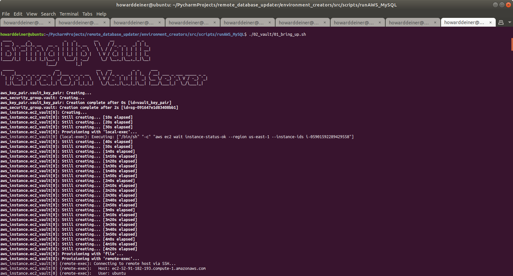\
and end with
<BR/>
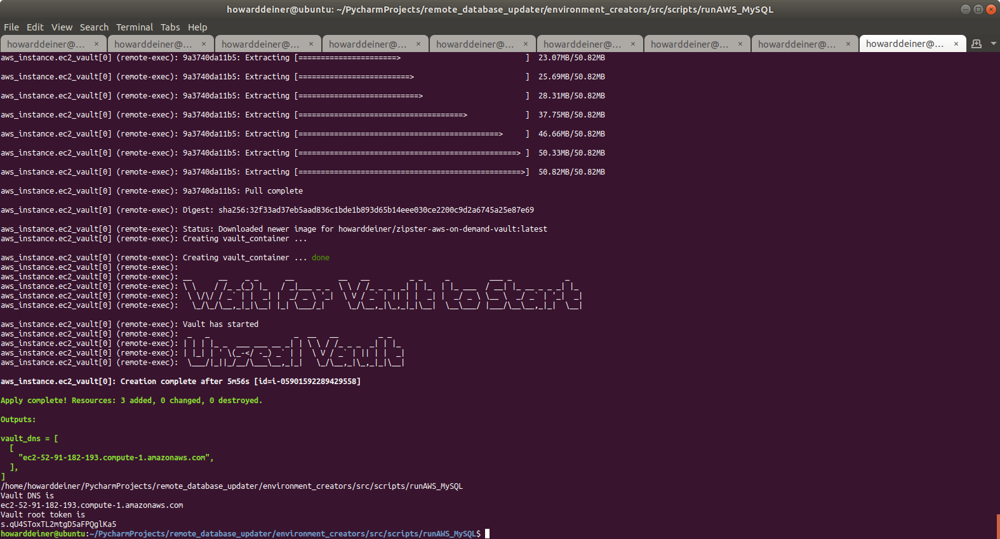\
<BR/>
By using that output at the end,
```console
Vault DNS is
ec2-52-91-182-193.compute-1.amazonaws.com
Vault root token is 
s.qU4SToxTL2mtgD5aFPQglKa5
```
we can login to Vault and see that everything is ready to store values with
<BR/>
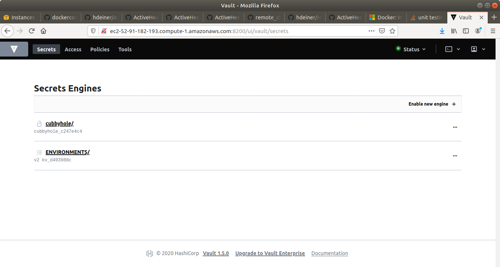\
<BR/><BR/>
The next thing to do is to bring up the AWS EC2 MySQL environment.  The way this Terraform code is structured, it not only creates the environment, but it is also respobsible to provision the environment and get the server running.  It starts with
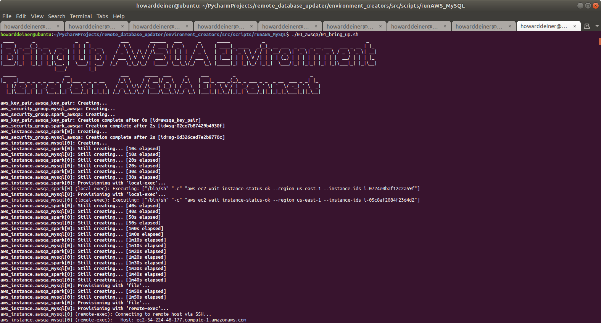\
and end with
<BR/>
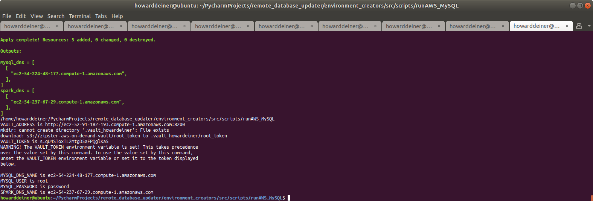\
<BR/>
Our code got executed right before this the end.  The console look like this
<BR/>
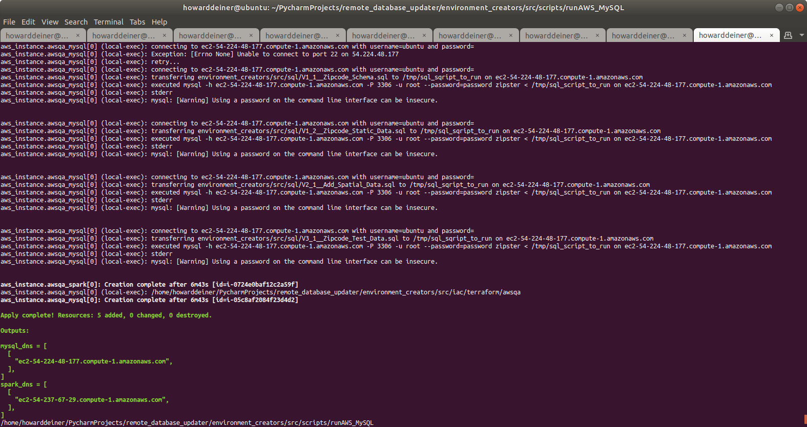\
<BR/>
So, how on earth did our silly little python script get intelligent enough to know which dynamically generated AWS EC2 instance to attach to and run the database updates on?  The secret starts at the end of the terraformResourceMySQL.tf script
<BR/>
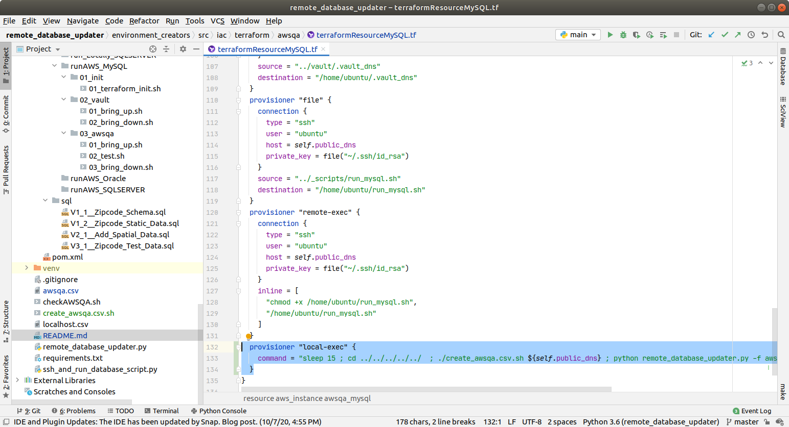\
<BR/>
In particular, let's concentrate on the highlighed provisioner clause.
```console
  provisioner "local-exec" {
    command = "sleep 15 ; cd ../../../../../  ; ./create_awsqa.csv.sh ${self.public_dns} ; python remote_database_updater.py -f awsqa.csv ; cd -"
  }
```
<BR/>
A new script called create_awsqa.csv.sh is called with the externally generated DNS for the MySQL server.  This creates the awsqa.csv file, which looks like this:

```console
sql_runner_host,sql_runner_userid,sql_runner_password,database_host,database_userid,database_password,port,database,sql_script_to_run
ec2-54-224-48-177.compute-1.amazonaws.com,ubuntu,,ec2-54-224-48-177.compute-1.amazonaws.com,root,password,3306,zipster,environment_creators/src/sql/V1_1__Zipcode_Schema.sql
ec2-54-224-48-177.compute-1.amazonaws.com,ubuntu,,ec2-54-224-48-177.compute-1.amazonaws.com,root,password,3306,zipster,environment_creators/src/sql/V1_2__Zipcode_Static_Data.sql
ec2-54-224-48-177.compute-1.amazonaws.com,ubuntu,,ec2-54-224-48-177.compute-1.amazonaws.com,root,password,3306,zipster,environment_creators/src/sql/V2_1__Add_Spatial_Data.sql
ec2-54-224-48-177.compute-1.amazonaws.com,ubuntu,,ec2-54-224-48-177.compute-1.amazonaws.com,root,password,3306,zipster,environment_creators/src/sql/V3_1__Zipcode_Test_Data.sql
```
Just for grins, we can look at the AWS Console to verify that, in fact, three EC2 instances are running.  (Of course they are!)
<BR/>
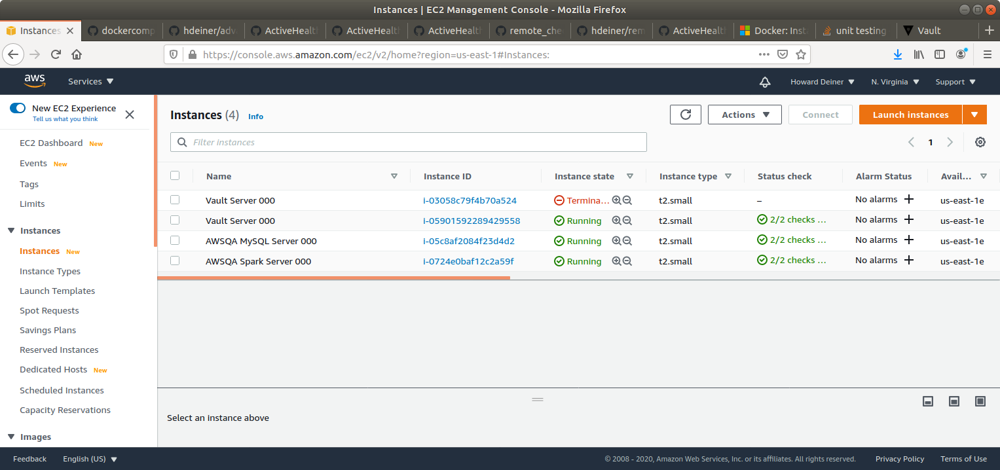\
<BR/>
We should also test that the environment is all working.
<BR/>
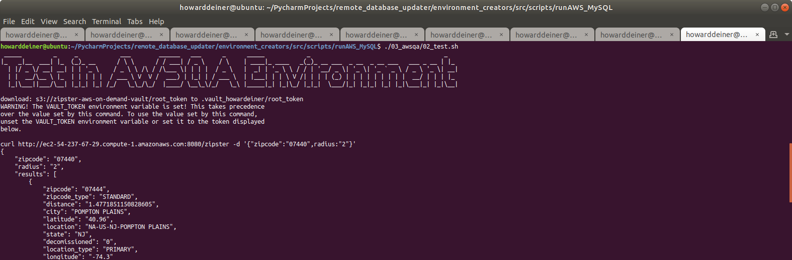\
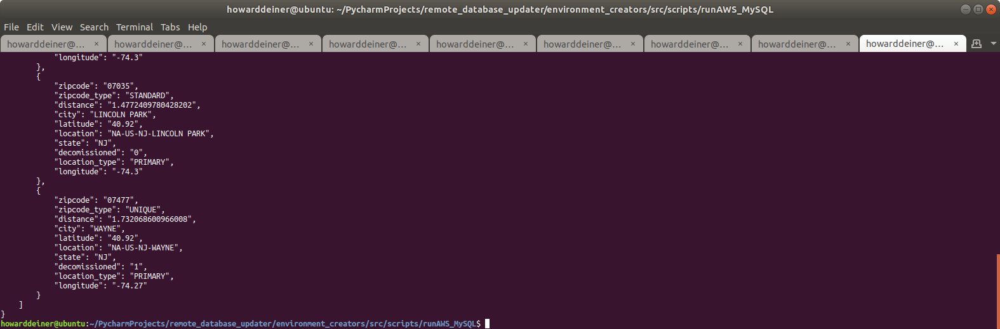\
<BR/>
And then we can bring down the environment.
<BR/>
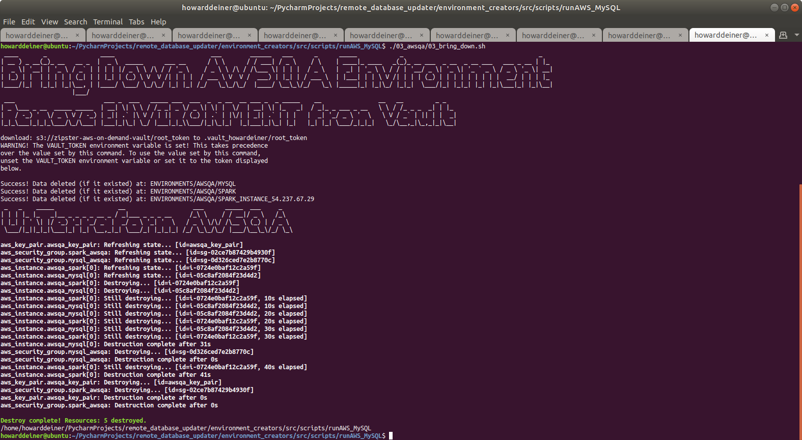\
<BR/>